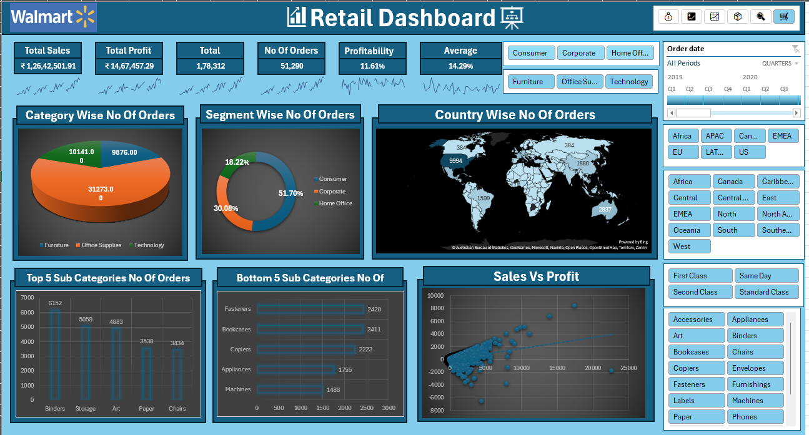

Excel Dynamic Retail Dashboard:

This project is an interactive Excel Retail Dashboard built using the Walmart dataset.  
It provides insights into Sales, Profit, Orders, KPIs, and Customer Segments with slicers and filters for interactive exploration.

---

# 📊 Dashboard Preview

---

Features :
- Key KPIs: Total Sales, Total Profit, No. of Orders, Profitability %, Average %.
- Charts & Visuals:
  - Category-wise Orders (Furniture, Office Supplies, Technology)
  - Segment-wise Orders (Consumer, Corporate, Home Office)
  - Country-wise Orders (Map view)
  - Top 5 Sub-Categories by Orders
  - Bottom 5 Sub-Categories by Orders
  - Sales vs Profit scatter plot
- Interactive Filters:
  - Year/Quarter timeline (2019–2020)
  - Region selectors (Africa, APAC, US, etc.)
  - Shipping Mode (First Class, Same Day, etc.)
  - Product Sub-Categories (Binders, Chairs, Machines, etc.)

---

Files in this Repository
- `Dynamic_Dashboard.xlsx` → Main Excel dashboard  
- `excel_dataset.xlsx` → Dataset used to build the dashboard  
- `screenshot.png` → Preview image of the dashboard  

---

How to Use:
1. Download both `Dynamic_Dashboard.xlsx` and `excel_dataset.xlsx`.  
2. Keep them in the same folder.  
3. Open `Dynamic_Dashboard.xlsx` in Excel (2019/2021/Microsoft 365 desktop).  
4. If prompted, Enable Editing and Enable Content (Macros/Queries).  
5. Refresh data if required via Data → Refresh All.

---

🛠 Requirements
- Microsoft Excel   
- Power Query (for refresh capability)

---

License: 
MIT License – you are free to use and modify.
0